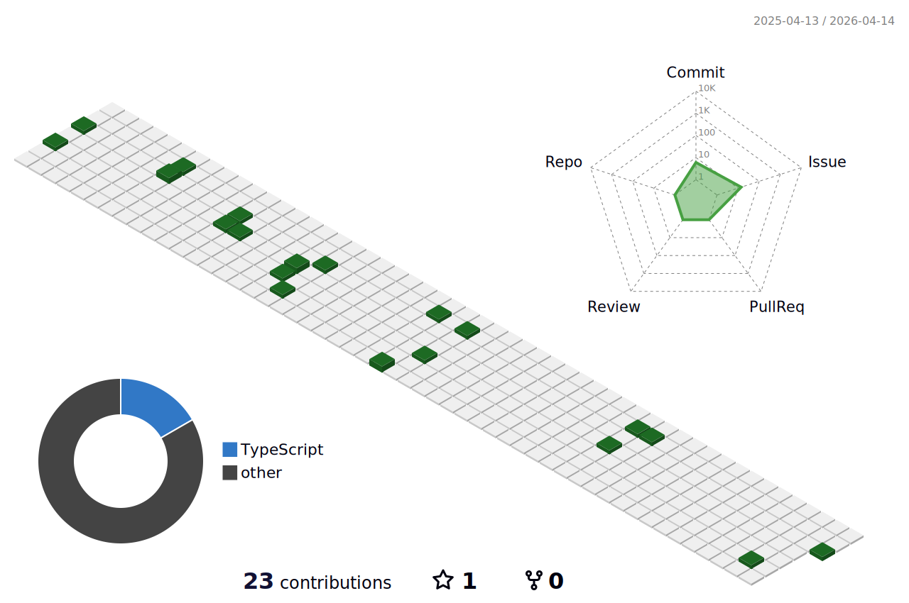

# 💫 Hey there:
I'm a Frontend engineer passionate about TypeScript and React, always chasing clean code and smooth UIs. 	•	💻 Working on: Performance tuning, scalable components, and making UIs snappier. 	•	🤝 Collaborate on: React, TypeScript, and fun open-source projects. 	•	🆘 Looking for help with: Debugging that one elusive production bug. 	•	📚 Learning: Next.js, Rust, and better state management. 	•	💡 Ask me about: React best practices, TypeScript quirks, and frontend optimization. 	•	🎉 Fun fact: I tweak UIs for hours but forget to eat—priorities!

## 🌐 Socials:
 

## 💻 Tech Stack:
 

## Activity

